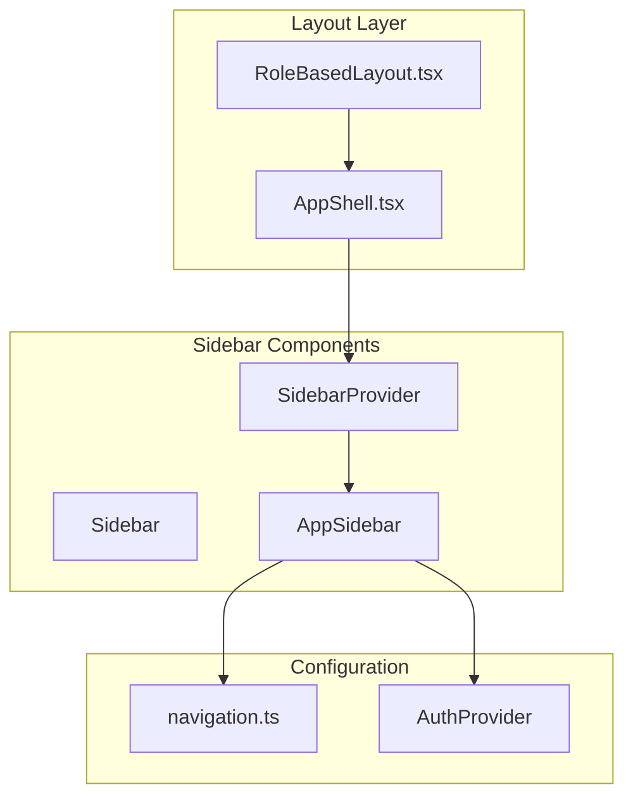

# Sidebar Panel Implementation Documentation

## Overview

The sidebar panel is implemented using a combination of Radix UI primitives, custom components, and role-based navigation. The implementation provides a collapsible sidebar with responsive behavior for both desktop and mobile devices.

## Architecture



## File Structure

```
src/
├── app/
│   ├── components/
│   │   └── AppShell.tsx          # Main layout shell
│   ├── config/
│   │   └── navigation.ts         # Role-based navigation config
│   └── layouts/
│       └── RoleBasedLayout.tsx   # Role-based layout wrapper
└── shared/
    └── components/
        ├── ui/
        │   └── sidebar.tsx       # Base sidebar UI components
        └── app-sidebar.tsx       # Custom app sidebar component
```

## Core Components

### 1. SidebarProvider ([`sidebar.tsx:54`](src/shared/components/ui/sidebar.tsx:54))

The `SidebarProvider` is the foundation of the sidebar system. It manages:

- **State Management**: Tracks `expanded` or `collapsed` state
- **Cookie Persistence**: Saves sidebar state to cookies for persistence
- **Mobile Detection**: Uses `useIsMobile()` hook to detect mobile devices
- **Keyboard Shortcut**: `Ctrl/Cmd + B` to toggle sidebar
- **Responsive Behavior**: Different behavior for desktop vs mobile

```typescript
const SidebarProvider = React.forwardRef<
  HTMLDivElement,
  React.ComponentProps<"div"> & {
    defaultOpen?: boolean
    open?: boolean
    onOpenChange?: (open: boolean) => void
  }
>
```

**Key Features:**
- Default open state: `true`
- Cookie persistence: 7 days (`SIDEBAR_COOKIE_MAX_AGE`)
- Width configuration: `270px` (expanded), `90px` (collapsed)

### 2. Sidebar ([`sidebar.tsx:163`](src/shared/components/ui/sidebar.tsx:163))

The `Sidebar` component handles rendering and responsive behavior:

- **Props:**
  - `side`: `"left"` or `"right"` (default: `"left"`)
  - `variant`: `"sidebar"`, `"floating"`, or `"inset"` (default: `"sidebar"`)
  - `collapsible`: `"offcanvas"`, `"icon"`, or `"none"` (default: `"offcanvas"`)

- **Mobile Behavior:** Renders as a Sheet component (Radix UI dialog)
- **Desktop Behavior:** Renders as a collapsible sidebar with CSS transitions

### 3. AppSidebar ([`app-sidebar.tsx:16`](src/shared/components/app-sidebar.tsx:16))

The custom `AppSidebar` component provides:

- **Role-based Navigation**: Shows menu items based on user role
- **Collapsed State**: Displays only icons when collapsed
- **Custom Styling**: 60px height menu items with 52px icon containers
- **Toggle Button**: Custom collapse/expand button with custom icons

```typescript
export function AppSidebar() {
  const { state, toggleSidebar } = useSidebar();
  const { pathname } = useLocation();
  const isCollapsed = state === "collapsed";
  
  const menuItems = currentUser?.role
    ? ROLE_NAVIGATION[currentUser.role as keyof typeof ROLE_NAVIGATION]
    : [];
}
```

### 4. AppShell ([`AppShell.tsx:11`](src/app/components/AppShell.tsx:11))

The `AppShell` component integrates the sidebar into the layout:

```typescript
const AppShell = ({ children }: AppShellProps) => {
  return (
    <SidebarProvider defaultOpen={true} className="flex flex-col">
      <TopHeader />
      <div className="flex flex-1">
        <AppSidebar />
        <main className="flex-1 bg-amber-50">
          {children}
        </main>
      </div>
    </SidebarProvider>
  );
};
```

## Navigation Configuration

### Role-based Navigation ([`navigation.ts:16`](src/app/config/navigation.ts:16))

Navigation items are configured per role:

```typescript
export const ROLE_NAVIGATION: RoleNavigation = {
  admin: [
    { title: "Home", url: "/dashboard", icon: Icons.HomeIcon },
    { title: "PEM Requirements", url: "/pem-requirements", icon: Icons.PEMRequirementsIcon },
    { title: "Discipline Activity List", url: "/discipline-activity-list", icon: Icons.DisciplineActivityListIcon },
    { title: "Control Object Checklist", url: "/control-object-checklist", icon: Icons.ControlObjectChecklistIcon },
    { title: "Document Checklist", url: "/document-checklist", icon: Icons.DocumentsChecklistIcon },
  ],
  user: [
    { title: "Home", url: "/dashboard", icon: Icons.HomeIcon },
    { title: "My Profile", url: "/profile", icon: Icons.DisciplineActivityListIcon },
  ],
};
```

## Styling

### Menu Button Variants ([`sidebar.tsx:512`](src/shared/components/ui/sidebar.tsx:512))

The sidebar menu buttons use custom styling variants:

| State | Style |
|-------|-------|
| Default | Transparent background, `#394B5B` text |
| Hover | `#F6F6F6` background, `#203446` text, 4px border radius |
| Active | `#081E32` background, white text, 8px border radius, `#051320` border |

### Dimensions

| Component | Size |
|-----------|------|
| Sidebar (expanded) | 270px width |
| Sidebar (collapsed) | 90px width |
| Menu item height | 60px |
| Icon container | 52px × 52px |
| Icon size | 24px |

## Responsive Behavior

### Desktop
- Sidebar is always visible on the left
- Collapsible to icon-only mode
- Smooth CSS transitions for width changes
- Tooltips appear on hover when collapsed

### Mobile
- Sidebar is hidden by default
- Renders as a Sheet component (slide-over drawer)
- Full-width on mobile (`270px`)
- Touch-friendly interactions

## Integration Points

### 1. Layout Integration
The sidebar is integrated via the `RoleBasedLayout`:

```typescript
export const RoleBasedLayout = () => {
  return (
    <AppShell>
      <Outlet />
    </AppShell>
  );
};
```

### 2. Route Integration
Routes are wrapped with `RoleBasedLayout` in the router configuration to ensure all authenticated pages have the sidebar.

## Available Exports

The sidebar module exports the following components:

| Component | Purpose |
|-----------|---------|
| `SidebarProvider` | Context provider for sidebar state |
| `Sidebar` | Main sidebar container |
| `SidebarTrigger` | Button to toggle sidebar |
| `SidebarRail` | Rail for edge-toggling |
| `SidebarInset` | Main content inset wrapper |
| `SidebarHeader` | Header section |
| `SidebarFooter` | Footer section |
| `SidebarContent` | Main content area |
| `SidebarGroup` | Group of menu items |
| `SidebarMenu` | Menu container |
| `SidebarMenuButton` | Menu item button |
| `SidebarMenuItem` | Individual menu item |
| `SidebarSeparator` | Visual separator |
| `useSidebar` | Hook to access sidebar context |

## Customization

### Changing Widths
Modify the constants in [`sidebar.tsx`](src/shared/components/ui/sidebar.tsx):

```typescript
const SIDEBAR_WIDTH = "270px"
const SIDEBAR_WIDTH_MOBILE = "270px"
const SIDEBAR_WIDTH_ICON = "90px"
```

### Adding New Menu Items
Add items to `ROLE_NAVIGATION` in [`navigation.ts`](src/app/config/navigation.ts):

```typescript
export const ROLE_NAVIGATION: RoleNavigation = {
  admin: [
    // ... existing items
    { title: "New Item", url: "/new-page", icon: Icons.NewIcon },
  ],
  // ...
};
```

### Modifying Menu Button Styles
Update `sidebarMenuButtonVariants` in [`sidebar.tsx`](src/shared/components/ui/sidebar.tsx:512) to change the appearance of menu buttons.
